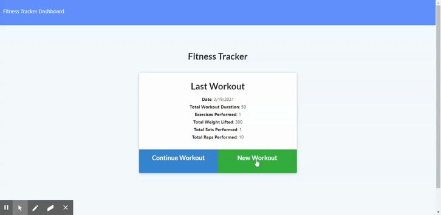

# Workout Tracker - Database

## Description
This app lets you track your workouts! When you first use the app only the "new workout" button should appear! Click this and you will be able to enter a cardio or a resistance workout, and then be able to enter more information. This will be saved and if you go to the dashboard the information you entered will be displayed! The front-end components were provided, so I worked in the backend. I added a server.js, workout.js model, and the API and HTML routes.

## Preview of Working Site



## Deployed Link

* [See Live Site](https://workout-tracker-database.herokuapp.com/)

## Code Snippet
The code below shows the get route for api/workouts. It uses aggregate, which is a built in method for mongoose. It creates a new object with the key of totalDuration and a value of the sum of the exercises.

``` JavaScript
app.get("/api/workouts", (req, res) => {
    workout.aggregate([
        {
            $addFields: { totalDuration: { $sum: "$exercises.duration" } }
        }
    ])
        .then(dbworkout => {
            res.json(dbworkout);
        })
        .catch(err => {
            res.json(err);
        });
});
```

## Built With

* [HTML](https://developer.mozilla.org/en-US/docs/Web/HTML)
* [CSS](https://developer.mozilla.org/en-US/docs/Web/CSS)
* [JS](https://www.javascript.com/)
* [GitHub](https://github.com/)
* [Git](https://git-scm.com/)
* [node.js](https://nodejs.org/en/)
* [npm](https://www.npmjs.com/)
* [express](https://www.npmjs.com/package/express)
* [MongoDB](https://www.npmjs.com/package/mongodb)
* [Mongoose](https://www.npmjs.com/package/mongoose)
* [Morgan]](https://www.npmjs.com/package/morgan)
* [Heroku](https://dashboard.heroku.com/)

## Authors

* **Peter Ting**

- [Link to Portfolio](https://portfolio-mk3.herokuapp.com/)
- [Link to Github](https://github.com/Pting1995)
- [Link to LinkedIn](https://www.linkedin.com/in/pting002/)